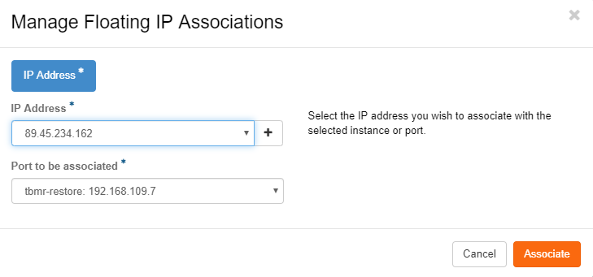
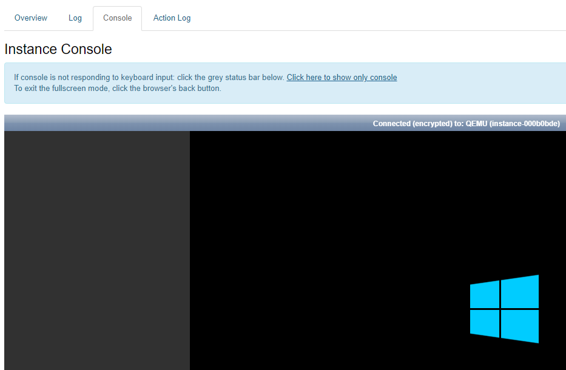
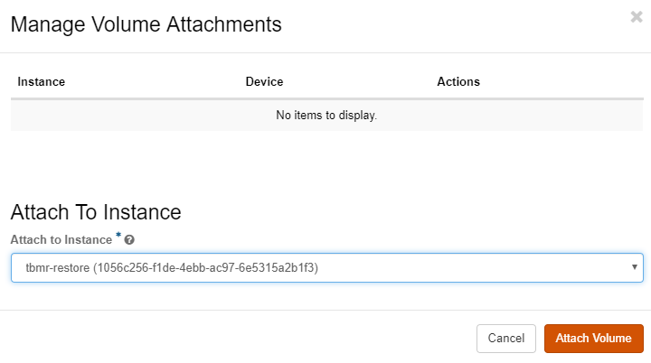
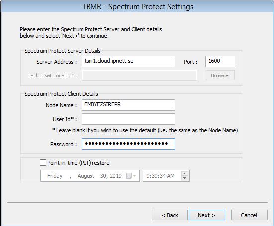
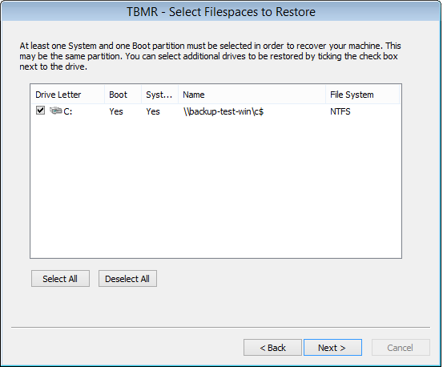
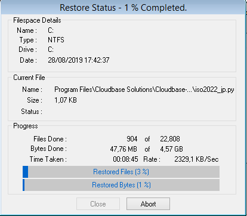
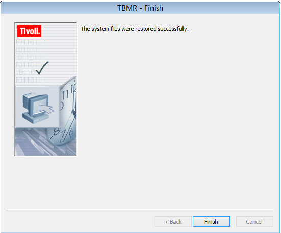
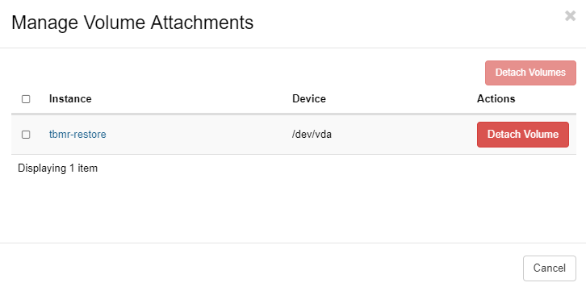
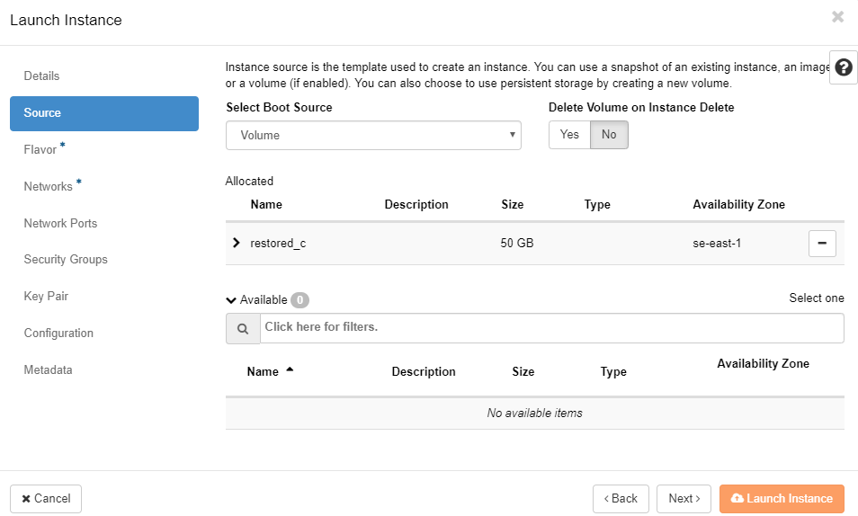
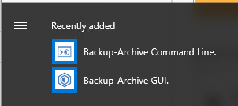

# Restoring Windows instance from Safespring Backup to Safespring Compute
Criste TSM Bare Machine Recovery (TBMR) is a solution that is included in the Safespring Backup service.
This document describes how to restore an instance from Safespring Backup using TBMR.

## Prerequisites

1. The machine we are going to restore must be protected with the Safespring Backup service
2. Your quota must be set high enough in order to set up a new machine as the same as you will restore
3. In order to make the restored machine you will need API access to Safesprings platform. Instructions for how to set that up can be found [here](/compute/api.md).

## Method

1. Start with going to the backup portal and rekey the node that you want to restore. You need to do this to have a password to use to connect to the backup server:

  

  Copy the new password and the node name to a notepad.

2. Now go to the compute portal and create volumes of the same size and type (fast/large) as the machine you will restore. Also create one volume for the root file system (C:).
   It is a good idea create volumes that are a couple of GBs bigger than the original volume just to be sure that the restored files will have enough space.

    

3. Now you go and start an instance which will use TBMR to restore the machine. Make sure to pick the TBMR image when you should Source:
    

4. Put the machine in a network where it can have internet access (does not have to be in the same network as the instance you are restoring even if it does not really matter).
    When you pick flavor "m.small" will suffice even though a larger instance with more memory and vCPUs could make the restore go faster. It does not matter what security groups
    you choose we only will interact with this instance through the web console.

    After you have launched the instance make sure to assign a floating IP to be able to reach the internet.
    

5. Click on the name of the newly created TBMR-instance and the click "Console"-tab at the top. You will see you newly created instance booting up. This takes a little while:
    
    In the meantime, go to "Volumes" and click "Manage Attachments" in the drop-down menu of the volume you have created to restore the machines root filesystem (C:)
    
    Repeat the process for all the other volumes if the instance has more than just C: 

    In the volume listing you should now see that the empty volume is attached to you TBMR-instance:
    

6. Now go back the web-console for the TBMR-instance and you should be greeted with the following dialogue:
    
    Click the "Start the manual Recovery wizard" and then click "Next". Pick "Restore from a Spectrum Protect node" and then "Next".
    

    In the next dialogue about the certificate - just click "Next".

    Now it is time to fill in the server and node information to restore. Unfortunately copy and paste does not work in the web console so you will have to fill in everything by
    hand. In order to get keyboard focus in the web console you also need to click on the gray area around the actual console window which is somewhat unintuitive.
    ```
    Server Address: tsm1.cloud.ipnett.se

    Port: 1600 (change from 1500)

    Node name: The node name that you saved in a notepad from step one.

    User Id: Leave blank
    Password: The password you created from step 1. Make sure you type it in correctly. 
    ```

    

7. If you have filled in the information correctly you will see that you successfully have established a connection to the backup server. If you have any typos you will see a red text
    telling you that you could not connect to the server. In that case click "Back" and ensure that you have gotten everything right.
    restore-contacting-backup-server.png
    When the fetching of configuration is done - click "Finish".
    Click "Next" in the next dialogue to create partitions and volumes.
    In the volume and layout configuration make sure that you have enough space for the volumes. You can in this stage choose to Swap or Ignore the target volumes if TBMR does not
    get the correct layout automatically. You get these options by right-clicking on a disk or volume. Just make sure that you have all the space you need to restore the machine.
    restore-volume-layout.png
    Click "Next" and then "Finish" when done. TBMR will now create the needed partitions. When that is done click "Close".

8. Click "Next" to start restoring the actual files. Select all the file spaces you want to restore and click "Next".
    

    The restore will now start. Depending on the size of the server this might take some time.
    
    If the volume you are restoring is C: TBMR will also restore the system state:
    

    When the restore is finished you will be greeted with this dialogue. Click "Finish".
    

9. Click "Next" to make the C: volume bootable. In the next dialogue you just click "Next" again:
    

    Click "Finish" to start the process and then "Close".

10. Now it is time for TBMR to install the needed drivers. Click "Next" in the "Dissimilar Hardware" dialogue and the "Next" again. If the backup was made from an instance
    running in Safespring Compute you will get a message saying, "No new devices were found in your system". Click "Finish".

11. Now you get back to the TBMR Recovery Environment. We should not reboot since we now will create a new instance which will be the actual restored instance. Head to "Volumes" in 
    Safespring Compute and detach the volume from the TBMR instance and then go to instances and delete the TBMR-instance after the volume has been detached.
    

12. Now it is time to make the volume for the restored C: drive bootable. In order to do this, you will need API access to Safesprings Compute setup correctly. Instruction for how to do that
    can be found [here](/compute/api.md). Type these to commands. In the second command you should copy the ID of your volume from the first command:
    ``` 
        $ openstack volume list
        +--------------------------------------+-------------------------+-----------+------+------------------------------------------+
        | ID                                   | Name                    | Status    | Size | Attached to                              |
        +--------------------------------------+-------------------------+-----------+------+------------------------------------------+        
        | 382c4764-e971-4cbb-a454-5eba1e17bcc7 | restored_c              | available |   50 |                                          |
        +--------------------------------------+-------------------------+-----------+------+------------------------------------------+
        $ openstack volume set --bootable 382c4764-e971-4cbb-a454-5eba1e17bcc7
    ```
13.  Now when the volume is made bootable you can go back to the Safespring Compute portal and create a new instance. The flavor should be the same as the original instance and
    should be put in the same network as the original instance. Also set the same security groups as the original instance. When you pick "Source" you should pick "Volume" in the dropdown and then the volume you have restored to and that you
    just made bootable.
    
    Launch the instance and assign a floating IP to it.

14. Go the the web console again and watch your restored instance booting up. When you come to the login screen wait a bit and let the instance reboot by itself one more time. After the second
    reboot you can login to you instance again but a better option is to login to it with RDP. 

15. All that is left now is to make sure that the backup software runs again on the restored machine. Go to the backup portal and rekey the node once more like you did in step 1.
    Copy the key to a notepad and go back to you instance. If you use RDP to connect to the instance you will be able to copy-and-paste the secret key which will make this step less prone
    to errors.
    Click the start menu icon and launch the "Backup-Archive Command Line" application:
    

16. When the command line client has started it will tell you its node name which should match the node name of the node you have restored from. Press enter when prompted for
    user id and then enter your newly generated password you got with the rekey operation in the former step. 

    

17. You have now successfully restored your Windows machine from backup. 


