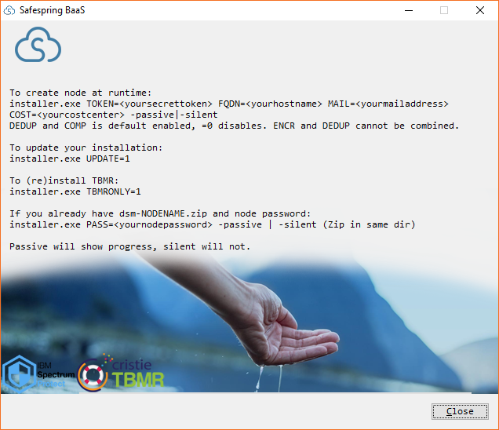
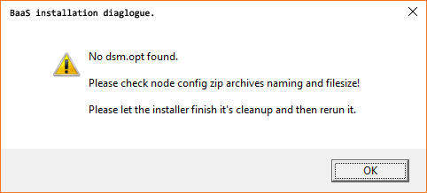
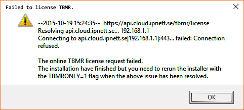
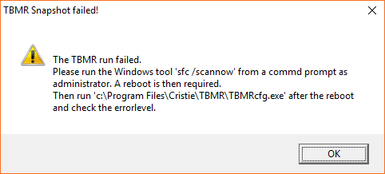
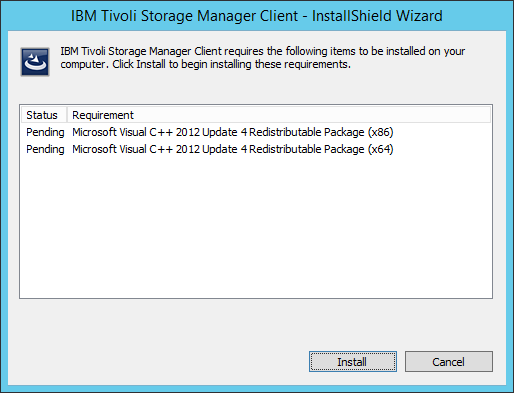

# Windows installation
## Auto installation

This installer installs the TSM BA Client and services and the TBMR client and licenses. It detects 32-bit or 64-bit platforms and contains both versions. Administative priviledges is required for all installations.

It can be run in two modes. The first mode requires that the administrator of the service has created a node and checked out the config file, `dsm-nodenamexyz.zip`, and have the password to this node.
Any user with administrative permissions can then install the services on their computer using the installer, zip and password.

The second mode includes the process of creating a new node and therefore requires API credentials and more settings. It is recommended to use credentials with limited numbers nodes and not your fully administrative credentials.

If credentials with unlimited permissions is used it is advised to delete all files in Windows `%TEMP%` directory after installation or failure to install since it may disclose secrets.
The installer makes it best to remove them but in some scenarios they might be left behind.

To see options and rules to run simply run:

```
safespring-baas.2.5.0.exe -help
```

All installer parameters must be in CAPITAL letters. Flags can be in lower case.



!!! info "PRO tip"
    **The installation process may take up to 25 minutes to complete. Especially the "TBMR Installation" may take quite a long time.** If you are running "Windows Defender" on Windows Server 2016 or Windows 10 you can speed up things by disable the realtime scan for the TBMR process. This can be done with a powershell command before you start the installer.

    From the command prompt, run as Administrator, do
    ```
    powershell -Command Add-MpPreference -ExclusionProcess {C:\Program Files\Cristie\TBMR\TbmrCfg.exe}
    ```

    To check the result, do
    ```
    powershell -Command Get-MpPreference | findstr ExclusionProcess
    ```


## Download
For Windows **8.1, 10, 2012** and **2016** please use this installer,
[https://repo.service.safedc.net/windows/safespring-backup.2.5.0.exe](https://repo.service.safedc.net/windows/safespring-backup.2.5.0.exe).

For older Windows versions please use this installer,
[https://repo.service.safedc.net/windows/safespring-backup.2.2.4.exe](https://repo.service.safedc.net/windows/safespring-backup.2.2.4.exe).


```
md5: aa15d64fb7f9a095b217dadd76157932  safespring-baas.2.2.4.exe
md5: 8f515a07efe9cfa6768643c3813e3e6c  safespring-baas.2.5.0.exe
```

## Space requirements
It is recommended to have at least **4 to 5 GB** of free space available for these services. Space is depending on TBMR driver collection and may vary between different hardware/platforms.
The installer pauses for 20 seconds if free space is < 5000000000 bytes. If `cancel` is pressed or timeout is reached the installer will abort. If `OK` is pressed, then will the installation continue and make an attempt.


## Modes
### Mode 1
To run in mode 1, place the installer and the `dsm-nodename.zip` in the same directory and run as follows.

!!! note "Example"
    ```shell
    safespring-baas.2.5.0.exe PASS=<password> (-passive | -silent)
    ```

The installer can be run in either manually, passive or silent mode. Passive shows the GUI and progress and silent runs without output in background. `PASS` is the node's current password.

### Mode 2
In order to use the fully automated install you must generate your secret token based on your access keys.
The access token only needs to be generated once and on any machine with openssl or PowerShell.
How to get your access-key and secret key can be read here, https://docs.safespring.com/backup/faq/#how-do-i-get-keys-to-generate-my-api-token.

Download and [install openssl](https://slproweb.com/products/Win32OpenSSL.html) then run the following script, or choose Powershell or bash instead.

``` shell tab="openssl"
echo <access-key>:<secret-key> | <\path\to\>openssl enc -base64 -e
```

``` shell tab="PowerShell"
$b = [System.Text.Encoding]::UTF8.GetBytes("<access-key>:<secret-key>")
[System.Convert]::ToBase64String($b)
```

```bash tab="Bash for Windows10"
echo -n "<access-key>:<secret-key>" | openssl enc -base64 -e
```

Mode two requires a few more parameters in order to create the node. `TOKEN` is the credential for the API, `FQDN` is a unique name for the node within your organisation, `MAIL` to a mailbox that is read and `COST` is the node costcenter.
`DEDUP` and `COMP` is default enabled but can be disabled by setting them `"=0"`. `ENCR` can be set but not in combination with `DEDUP=1`.
For updates when already running UPDATE=1 can be used. It is not possible to downgrade.
To rerun the TBMR part only and because of TBMR license failures you can run with TBMRONLY=1.

Put the `safespring-baas.2.5.0.exe` in a directory where you have write permissions since it will write the `dsm-<nodename>.zip` file in the current directory.


!!! note "Example"
    ```shell
    safespring-baas.2.5.0.exe TOKEN=<secrettoken> FQDN=<uniquename> MAIL=<mailaddress> COST=<costcenter> (-silent | -passive)
    ```

The installer can be run in either manually, passive or silent mode. Passive shows the GUI and progress and silent runs without output in background.

`PLATFORM` is read from the system and cannot be specified.

!!! info "Noteworthy"
    All possible measures have been taken to prevent reboot but runtime libraries can cause unpredictable results. To add extra safety measures an additional flag can be used, `-norestart`.

## Updates
The installation can be updated and completed with both new TSM and TBMR
version if the installer is run with the UPDATE argument.
`safespring-baas.2.5.0.exe UPDATE=1`.
Then the same nodename and configuration is kept and all components is updated
if required. If only TBMR should be installed or updated it can be run with the
TBMRONLY argument. `safespring-baas.2.5.0.exe TBMRONLY=1`. This method can also be used to license TBMR if it is trial or unlicensed for some reason.

## Revision history
* **1.0**
    * Initial version for Windows 8, 8.1 and 2012.
* **1.1**
    * Initial version for Windows 7, 2008.
* **1.1.1**
    * Bugfix version for Windows 7, 2008.  *  Handle cleanup when running RDP with per session temporary folders.
* **1.0.1**
    * Bugfix version for Windows 8, 8.1 and 2012.
    *  Handle cleanup when running RDP with per session temporary folders.
* **1.2**
    * Bugfix, really surpress reboot on vcredist update.
    * New TSM client, 7.1.2.0
    * Oneforall installer for all MS.
* **1.2.2**
    * Bugfix, correctly exit if node creation or config checkout fails when running mode 2.
    * Extended checking and logging for troubleshooting.
* **1.3.0**
    * New TBMR version, 7.2.2.
    * New TBMR trial license valid to 2015-11-01.
    * Internal: API call for new node in mode 2 changed to JSON format.
* **1.3.1**
    * Accepts node configfile from portal and API.
    * Better errorhandling and cleanup on failures.
    * Space requirement check and dialogue to force install if requirement not met. (5000000000 bytes)
    * Unique exitcodes from each step for faster troubleshoting.
    * Dialogue for node config failures on file and credentail problems.
* **1.3.2** Fix for overwriting dsm.opt if it already exists.
* **1.3.3** Fix for more robust handling of configuration zip file. Can be run from shared and read-only media.
* **2.0.1**
    * RESTinTBMR license API used handle TBMR license.
    * Allow update of old installations and without cretentials, UPDATE=1.
    * Allow running TBMR only through modify/repair, TBMRONLY=1.
    * Modifies dsm.opt, adding a PRESCHEDULECMD
    * Creates and updates C:\Program Files\Cristie\TBMR\TBMRcfgWrapper.cmd script to secure running tbmr BEFORE each backup by above PRESCHEDULECMD.
    * Leaves a binary file, C:\Program Files\Cristie\TBMR\wget.exe for future use to report missing drivers.
   GNU Wget 1.11.4  http://gnuwin32.sourceforge.net/packages/wget.htm
    * Not forced to do passive or silent mode.
    * New TSM version, 7.1.3.0
    * Stays in ARP to handle updates.
    * Warns if TBMR licensing fails.
    * Hides secrets in logfiles natively.
* **2.0.2**
    * Fix for PRESCHEDULECMD failing scheduled backups.
    * Fix for expired TBMR maintenance date.
* **2.0.3** Fix for TBMR license failure.
* **2.1.1**
    * New TSM versions, 32-bit 7.1.3.2, 64-bit 7.1.4.2.
    * New TBMR version, 7.3.1.
    * Certificates bundled for all wget requests.
    * Improved logging for easier troubleshooting.
    * Warns and aborts if space in path from where the installer is run. See Pitfalls.
* **2.2.0**
    * New TSM version, 7.1.6.0.
    * New TBMR version, 7.5.1.
    * Internal API call change.
* **2.2.1**
    * New TSM x64 version, 7.1.6.2.
    * Fixed a flag to prevent reboot.
* **2.2.2**
    * New TSM x64 version, 7.1.8.2.
    * New TSM x32 version, 7.1.8.2.
    * New TSM server certificate, safedc.net.
    * Cosmetic changes.
* **2.3.1**
    * New TSM x32 version, 7.1.6.4.
    * New TSM x64 version, 8.1.0.0.
    * New TBMR version, 8.1.1.
* **2.3.2**
    * Prevent installation on non-suppported Windows versions.
    * Logname typo.
* **2.3.3**
    * New TSM x32 version, 7.1.6.5.
    * New TSM x64 version, 8.1.0.2.
* **2.3.4**
    * Bugfix for Mode 1 installations where TSM was used before.
    * New TBMR version, 8.1.3.
* **2.3.5**
    * New TSM x64 version, 8.1.2.0.
    * New TBMR version, 8.1.4.
    * Cosmetic changes.
    * Added some more errorchecking on TBMR result code. See Pitfalls below.
* **2.4.0**
    * New TSM x64 version, 8.1.4.0.
    * New TSM server certificate, safedc.net.
* **2.4.1**
    * New TBMR x64 version, 8.1.4.
* **2.4.3**
    * New TSM x64 version, 8.1.7.0.
    * New TSM x32 version, 7.1.8.4.
    * New TBMR x64 version, 8.4.
* **2.4.4**
    * New TSM x64 version, 8.1.7.1.
    * New TSM x32 version, 7.1.8.5.
* **2.4.8**
    * Bugfix for "0x800700ff - The extended attributes are inconsistent"
    * New TBMR x64 version, 8.5.
* **2.4.9**
    * New TSM x64 version, 8.1.9.0.
    * New TSM x32 version, 7.1.8.7.
    * Bugfix for c++ runtime versions
    * Updated Cristie TBMR license, ends 2020-12-31.
* **2.2.4**
    * New TSM x32 version, 7.1.8.7.
    * New TSM x64 version, 7.1.8.7.
    * New TSM server name, safedc.net.
    * New TBMR Licenses.
* **2.5.0**
    * New TSM server name, safedc.net.
    * New TBMR x64 version, 8.5.

## Pitfalls

!!! warning "Things to look out for."

    * Make sure you have no spaces in the path from where you run the installer. The path cannot be escaped by the Wix installer so it will be an offset in the input paramters.
    * When installing with Anti-Malware program running it may delete installer files since they are wrapped with 7-Zip SFX maker. This may trigger false positve on anti malware. Solution, temporary disable your AM software.
    * If a faulty node configuration zip is detected or lack of credentials the installer will abort with this message. The installer will accept zip's from both the API and the portal.
    
    * If the licensing of TBMR fails you can be asked to rerun the installer again with TBMRONLY=1.  
    
    * If TBMR fails to find mandatory files you may need to run SFC to check your
    system files.
    

## Report problems
In case of reporting a problem please include ALL logfiles from `%TEMP%` named `Safespring*.*`, `BaaS*.*` and `Cristie*.*`.

## Manual installation

### Microsoft Windows (64-bit)

_This document describes how to **manually** install IBM TSM on Windows Windows (64-bit)._
(Tested on Windows 2008 64-bit R2 SP1)

Required files - (Right click and 'Save as...'):

- [7.1.1.0-TIV-TSMBAC-WinX64.exe](https://archive.service.safedc.net/tsm/mirror/maintenance/storage/tivoli-storage-management/maintenance/client/v7r1/Windows/x64/v711/7.1.1.0-TIV-TSMBAC-WinX64.exe)
- [Safespring Root CA installer](https://raw.githubusercontent.com/safespring/cloud-BaaS/master/pki/IPnett-Cloud-Root-CA-win64.bat)

### Procedure

1. Download the required files according to above into a temporary folder
1. Run `7.1.1.0-TIV-TSMBAC-WinX64.exe` to install the program and *hold* at the following point:

    

    1. The installation process will by default require a reboot, due to the installation of a couple of VC redistributables.
    1. If a reboot is unpleasant, at the above decision point, jump to the _"Circumvent reboot during install"_ section below.
    1. Resume the installation, choose Typical installation and accept the UAC pop-up that comes up, "IBM manager".
    1. After installation, answer 'No' to the reboot question.

1. In a command prompt with elevated privileges, execute the "Safespring Root CA installer" to install the Safespring BaaS CA into the GSK (IBM crypto kit) trust database.
    ```
    IPnett-Cloud-Root-CA-win64.bat
    ```
1. Create a backup client node via the BaaS API, and save the node password for future reference.
    ```
    perl ipnett-baas.pl create node <fqdn> <costcenter> <flags>
    ```
1. Retrieve client node configuration and password from the BaaS API or the web portal, and unpack the `dsm.opt` file into `C:\Program Files\Tivoli\TSM\baclient\`.
    ```
    perl ipnett-baas.pl get node <nodename> config
    ```
1. Set the client's password.  In `C:\Program Files\Tivoli\TSM\baclient`, enter
    ```
    dsmc set password <PASSWORD> <PASSWORD> <PASSWORD>
    ```
1. E.g invoke client: `dsmc`.  Then to do full incremental on entire system: `i` for incremental.
1. Setup scheduling: Go to the portal, select Update on the node you are installing, choose a schedule and a retention period you want to have.

    For API users, https://github.com/safespring/cloud-BaaS/blob/master/API.md documents the various calls, including scheduling.

### Circumventing reboot during install

On Windows x64, *all* of the below packages are required to install.

```shell
:: Start command prompt
:: To avoid UAC questions, run the prompt as administrator.
:: Files are extracted to the directory where the installer is executed.
TSMClient\ISSetupPrerequisites\{270b0954-35ca-4324-bbc6-ba5db9072dad}
:: (contains MS 2010 x86 C++ Runtime - vcredist_x86.exe)
TSMClient\ISSetupPrerequisites\{BF2F04CD-3D1F-444e-8960-D08EBD285C3F}
:: (contains MS 2012 x86 C++ Runtime - vcredist_x86.exe)
TSMClient\iSSetupPrerequisites\{7f66a156-bc3b-479d-9703-65db354235cc}
:: (contains MS 2010 x64 C++ Runtime - vcredist_x64.exe)
TSMClient\ISSetupPrerequisites\{3A3AF437-A9CD-472f-9BC9-8EEDD7505A02}
:: (contains MS 2012 x64 C++ Runtime - vcredist_x64.exe)

Run each of them with these flags,
"vcredist_x(86|64).exe /install /quiet /norestart /log logfilename"
```
