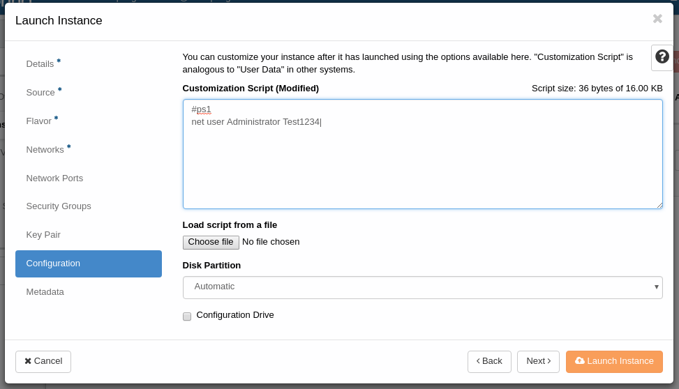

# Windows instances

## Cloudbase

We use windows images from  [cloudbase](https://cloudbase.it/windows-cloud-images/). The image comes configured with [cloudbase-init](https://cloudbase.it/cloudbase-init/). This is similar to the cloud-init system we use for linux-based instances. The images also comes with RDP enabled.

## Password for Administrator user

The images comes with the Windows _Administrator_ user. In order to enable this user, the password must be changed by accessing the instance console (e.g. from the Horizon dashboard).

## Cloudbase-init admin user

Generally, we recommend leaving the _Administrator_ user disabled, and instead using Cloudbase-init to generate an admin user.

Cloudbase-init generates an user named _Admin_. The _Admin_ user is added to the Administrators group.

The _Admin_ user is assigned a random password on installation, which can be retrieved by the following method:

### Generating a key pair for admin user password retrieval

Under the Compute > Access & Security menu, select the "Key Pairs" tab, press "+Create Key Pair".

Give the key pair a describing name, for instance "windows-passwords". Press "Create Key Pair".

A file called windows-passwords.pem should be dowloaded to your computer. Take good care of this file as it is used to decrypt your admin passwords.

### Creating a Windows instance via webui

You create a Windows instance in much the same way as [any other instance](./getting-started.md), by selecting one of the windows images under the Source menu.

In the "Key Pair" section of the "Launch instance" dialog, select the key pair "windows-passwords" you created earlier.

### Retrieving the admin password via webgui

After creating the instance, locate it (under Compute > Instances) and click on the related pull-down menu. Select "Retrieve Password". Under "Private Key File", select "Choose file" and select the .pem file you downloaded earlier. Click "Decrypt Password".
The password should show up in the "Password" field.

### ALTERNATE: Retrieving the admin password using the nova commandline

If you have access to the openstack commandline tools you can use nova to retrieve the password. Ensure the correct `OS_` environment variables are set, then run

`nova get-password winbox1 ~/keys/windows-passwords.pem` - where winbox1 is your windows instance and ~/keys/windows-passwords.pem is the private key file from the key pair you generated earlier.

## Setting the Administrator password (and other things) under instance creation

Cloudbase can run powershell scripts under instance creation. This can for instance be used to set the Administrator user password. The script can either be written directly into the "Customization Sctipt" field under "Configuration" or uploaded as a file in the same dialog box.

For some reason it seems impossible to set the password for the "admin" user using this method, although setting it for "Administrator" seems to work just fine.

Basically anything that a user in the Administrators group can do via powershell should be able to run via this method.

The full [cloudbase documentation](http://cloudbase-init.readthedocs.io/en/latest/) is available online.

!!! warning
    Anything entered in the Customization Script dialog box can end up stored in log files etc and as such if used to set passwords these should only be for very temporary usage
 
