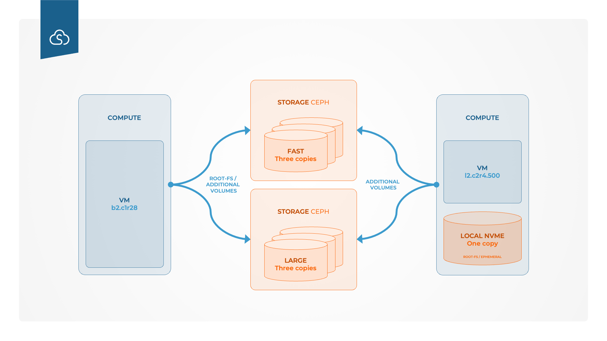

# Flavors
This chapter describes the different flavors and how they are used in the platform. It is important to understand what the different flavors imply and which combinations that is possible to boot a working instance.

## b2 flavors (block storage)

!!! info "versions"
    The first number in the flavor name (l2 or b2) denotes a particular version of this flavor. We might introduce other versions in the future with different properties.

Instance created with these flavors need a volume to boot from. See below how to accomplish that.

| Flavor name    | Description                                                                  |
| -------------- | ---------------------------------------------------------------------------- |
| `b2.c1r2`      | ram: 2048, vcpus: 1, disk: 0             |
| `b2.c1r4`  | ram: 4096, vcpus: 1, disk: 0             |
| `b2.c2r4`  | ram: 4096, vcpus: 2, disk: 0                           |
| `b2.c2r8`| ram: 8192, vcpus: 2, disk: 0                           |
| `b2.c4r8`| ram: 8192, vcpus: 4, disk: 0 |
| `b2.c4r16`| ram: 16384, vcpus: 4, disk: 0 |
| `b2.c8r16`| ram: 16384, vcpus: 8, disk: 0 |
| `b2.c8r32`| ram: 32768, vcpus: 8, disk: 0 |
| `b2.c16r32`| ram: 32768, vcpus: 16, disk: 0 |
| `b2.c16r64`| ram: 65536, vcpus: 16, disk: 0 |

## l2 flavors (local disk)

Instances created with these flavors must be booted from an image and not a volume. See below how to accomplish that.

| Flavor name    | Description                                                                  |
| -------------- | ---------------------------------------------------------------------------- |
| `l2.c2r4.100`| ram: 4096, vcpus: 2, disk: 100, read_iops: 10000, write_iops: 5000 |
| `l2.c2r4.500`| ram: 4096, vcpus: 2, disk: 500, read_iops: 50000, write_iops: 25000 |
| `l2.c2r4.1000`| ram: 4096, vcpus: 2, disk: 1000, read_iops: 100000, write_iops: 50000 |
| `l2.c4r8.100`| ram: 8192, vcpus: 4, disk: 100, read_iops: 10000, write_iops: 5000 |
| `l2.c4r8.500`| ram: 8192, vcpus: 4, disk: 500, read_iops: 50000, write_iops: 25000 |
| `l2.c4r8.1000`| ram: 8192, vcpus: 4, disk: 1000, read_iops: 100000, write_iops: 50000 |
| `l2.c8r16.100`| ram: 16384, vcpus: 8, disk: 100, read_iops: 10000, write_iops: 5000 |
| `l2.c8r16.500`| ram: 16384, vcpus: 8, disk: 500, read_iops: 50000, write_iops: 25000 |
| `l2.c8r16.1000`| ram: 16384, vcpus: 8, disk: 1000, read_iops: 100000, write_iops: 50000 |
| `l2.c16r32.100`| ram: 32768, vcpus: 16, disk: 100, read_iops: 10000, write_iops: 5000 |
| `l2.c16r32.500`| ram: 32768, vcpus: 16, disk: 500, read_iops: 50000, write_iops: 25000 |
| `l2.c16r32.1000`| ram: 32768, vcpus: 16, disk: 1000, read_iops: 100000, write_iops: 50000 |

## b2. and l2. flavors

The flavors starting with b2 does not come with any disk space in the flavor. You can see this in the flavor listing when starting the instance that they have a zero in the "Root Disk" column. This means that in order to boot an instance with such a flavor the root disk must be created beforehand under "Volumes". The procedure is to create a new volume and choosing that it should contain an image that you pick in the drop down "Use Image as Source" which is visible if you pick "Image" under the drop down "Volume Source".

Once the boot volume is created you can choose that as you boot media when creating the instance by first choosing "Volume" under the "Select Boot Source" under the "Source"-tab in the "Launch instance"-dialogue. 

!!! info "PRO tip"
    After creating the volume from the image you can also start from the "Volumes" view and click the "Launch as Instance" in the context menu at the end of the row of the volume you just have created. You will now be redirected to the "Launch Instance"-dialogue with the correct settings in the "Source"-tab to boot your instance from the volume.

The flavors starting with l works a little bit different since they come with a root disk in the flavor. The l signals "local disk" and means that the instance will be created with a local disk coming with the flavor.

To boot these instance one should boot from "Image" under the "Source"-tab in the "Launch Instance"-dialogue. The image will be copied to the root disk of the instance before start.

!!! info "Important Note"
    It is important to understand the implications of the local disk flavors. The performance of them will be higher but the virtual disk created will be a single point of failure. If the physical disk, on which the virtual disk is placed, crashes, the instance will not be restorable. **Therefore it is important that these instances either are stateless or backed up properly.** When setting up flavors with l2 flavors that are members of a cluster, it is recomended to use the feature "Server Groups" with a Anti-Affinity group associatied with you cluster members to ensure that the local disks end up on different computes nodes. You do not want to end up with a cluster where all the members in the cluster use the same local storage, since a failure on that storage will affect all the cluster members.

To spread capacity fairly over instances the IOPS quota on them are linear to the amount of disk space they reserve. This means that an l-flavor ending with 500 has five times the amount of IOPS reserved than an l-flavor ending with 100. A flavor ending with 1000 has ten times IOPS quota compared to 100. This should be taken into consideration if IOPS is important for your application running in the instance even though you do not need a larger disk space. The higher amount of disk reserved the faster the disk will be. You can see this in the table above for the l2 flavors. 

    If you have API-access you can view the IOPS quota with the command:

    openstack flavor list --long

!!! info "Conclusion"
    Flavors starting with l2 should be booted from "Image". Flavors starting with b2 should be booted from a volume created from an image. Combinations such as booting a l2-flavor from volume or b2-flavor from image will not work and render an error.
