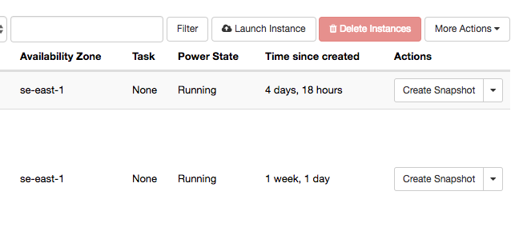
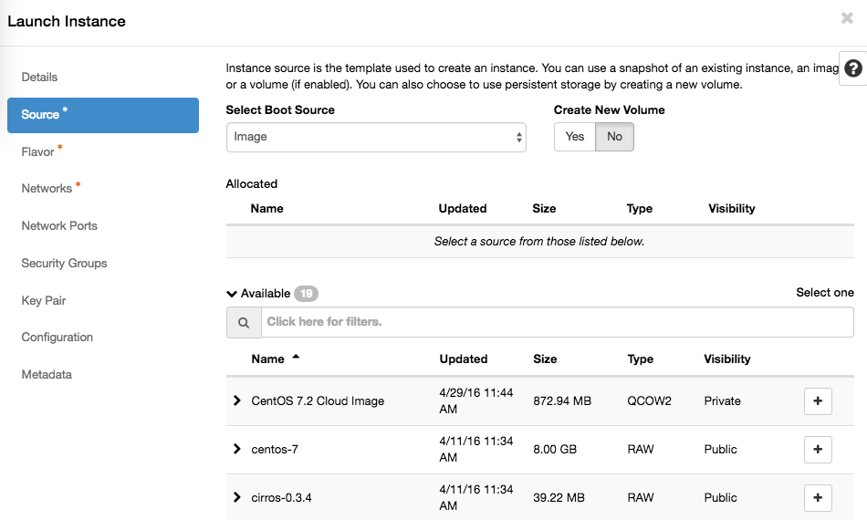
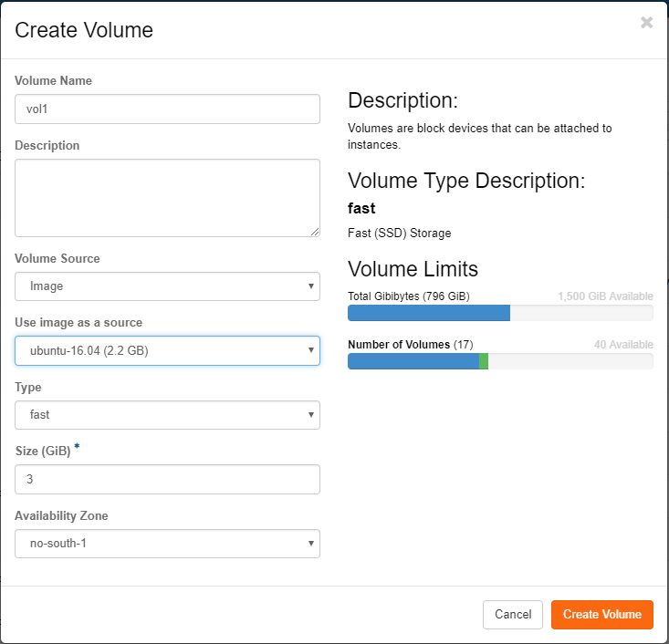
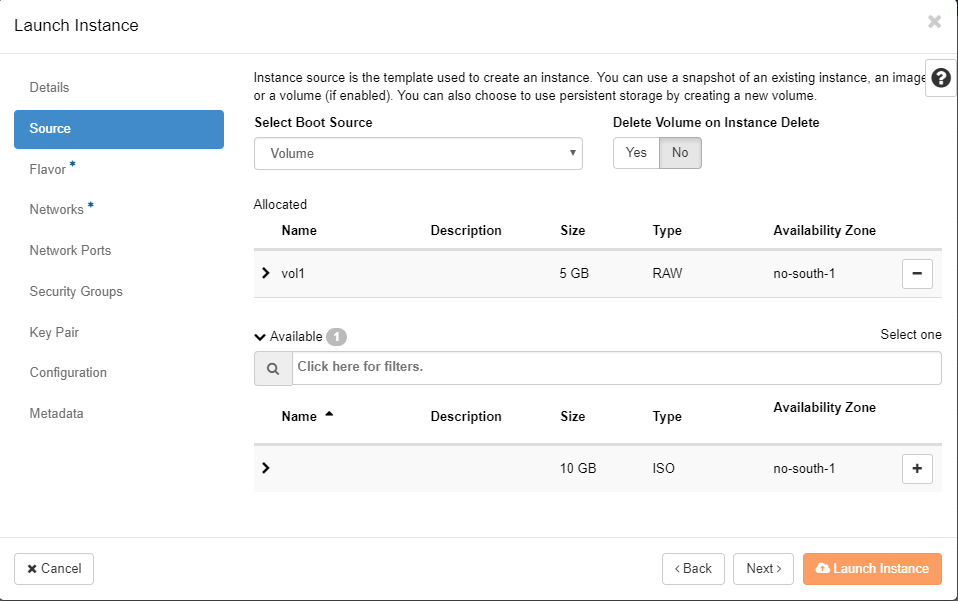
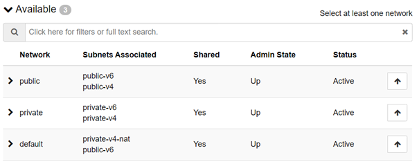
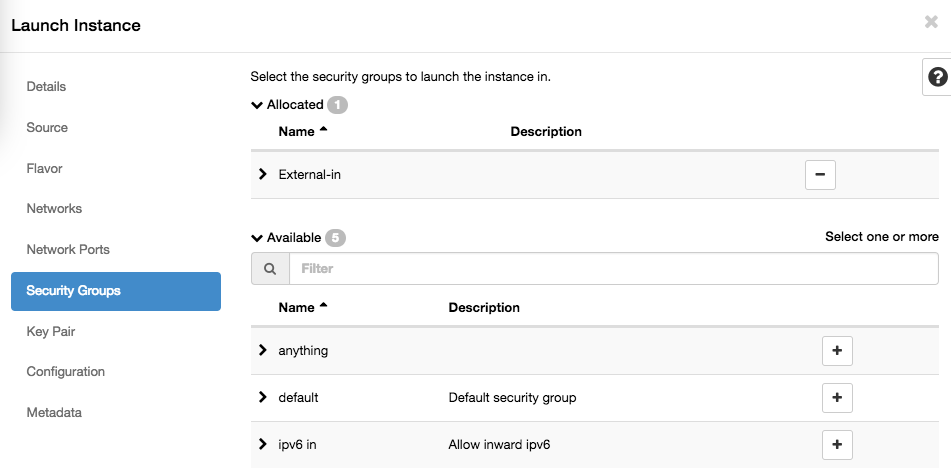
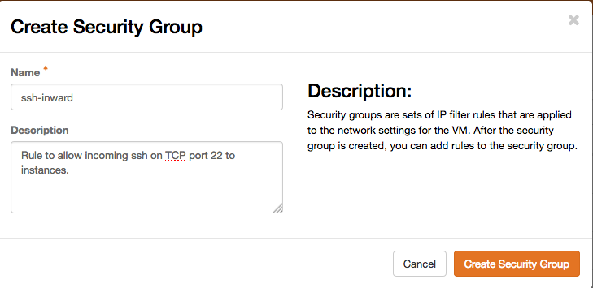
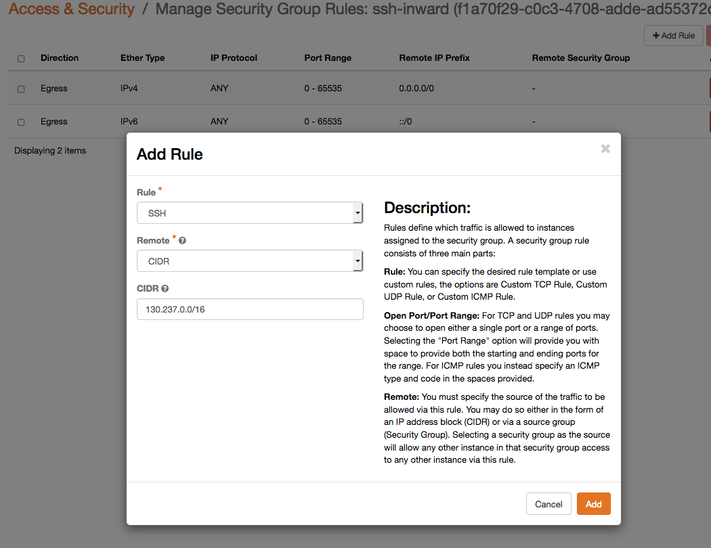
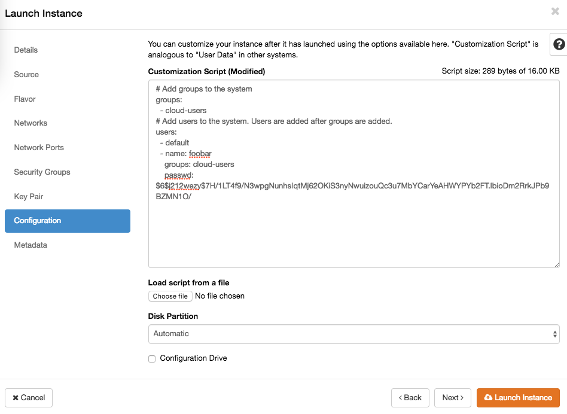

# Getting Started

## I just got a Safespring Compute account, what now?


Start by logging into the portal. You will be greeted with an overview of the project/account statistics. It usually starts off rather empty, but as machines are added, resources will be summarized there.

* **Swedish site sto1** portal: https://dashboard.sto1.safespring.com
* **Norwegian site osl1** portal: https://dashboard.osl1.safespring.com

!!! info "Legacy sites"
    The old sto1 site is accessible through the SUNET dashboard at <https://dashboard.cloud.sunet.se>. for all users. The old osl1 site is accessible at https://login.osl1.safespring.com for all users. If you use the API at legacy sites, please refer to this documentation: https://docs.safespring.com/service/known_issues/#cloudipnettnose-domains

## Virtual Machines

Openstack calls VMs "instances" so in order to start running a few machines, you go to the Instances category, and use Launch Instance(s) to get your first VM up.



When creating an instance, you get asked about if you want to create a volume, and if you answer yes to that, also if you want it deleted after deleting the instance.

It is normally not necessary to create a (new) volume for a new instance, answering No means that you will get a disk of the preferred size pre-configured for your chosen OS image. For machines with shorter lifespans (tests, validation and so on) this may be a good alternative. Disks created alongside with the OS image are sometimes referred to as 'ephemeral disks'. Regardless of if you create a volume / disk manually or not, you can always attach more disks later on.



Before we go into starting VMs, let's take a quick look at the concepts and names used in this cloud implementation.

## Volumes and Images

Whenever a disk is created in Openstack, it will be a volume. A volume may be snapshotted and the snapshot may later be reused on the same instance or on other instances.

You may also add or upload "passive" disks called Images (including ISO images) that may be used to hold templates for instances or to install from, in the case of ISO images. A volume can be converted to an image, in case you prepare a machine and later want to duplicate it many times.

We supply a certain amount of public images, but you can have an own per-project list of images your project members can choose from which will not be visible to others. The public images are good starting points and may be used for generic instances, but the more specifics you add, the more reason for creating customized images where local edits can be prepared once and reused for all machines.

Also, while we try to keep the public images up-to-date when publishing them, keeping such an image patched, updated and secure falls upon you after starting the instance on it, after that point, any edits and improvements to the base image will not be reflected in your instance.

Using snapshots to freeze volumes is a useful technique for being able to back out of tests, but do mind to clean out unused snapshots when they are no longer of interest, since they count against your storage quota.

All flavors in Safesprings platform come with a 40 GB root disk. In the case you would want another size on the root disk you first create a volume under "Volumes" and pick Volume Source as Image and  then pick the image that corresponds to the operating system you want to run on the instance.




After creating the volume you head to the "Launch instance" dialogue. Under "Source" you pick "Volume" from the pick-list and then press the plus sign for the volume you created in the former step. You can also choose whether the volume should be persistent or not by switching the "Delete Volume on Instance Delete" option.




## Flavors and Local Storage
You can read more about the different flavors and what they mean [here](/new/flavors/)


## Boot from image
The simplest way of booting an instance is to boot it directly from the image service. By doing so you will use the ephepmeral storage. Ephemeral storage means that the storage lifetime is tied to the instance. It will persist as long as the instance exists but will automatically be deleted if the instance is deleted. If the instance you're starting is of a stateless type, with maybe any more persistent data is stored on a separate volume this is a good option.

To boot an instance from image, use the regular "Launch instance" wizard in the GUI. In the "Source" tab make sure the dropdown menu at the top is "Image" and also make sure that the "Create New Volume" is set to "No".

In the flavor tab it is now important to pick a flavor with lokal storage in order for the image to be put somewhere. These flavors start with an "l", example lb.small which has a root disk on lokal disk of 20 GB.

Continue the wizard to create the server. Now you have created an image based instance which is backed by local storage on the compute node where it is running. The upsides with this is that local storage is much faster than central storage. The downside is that the local storage only is stored in one copy on the compute node which means that if the hard drive on that compute node fails, dataloss will occur. If all the persistent datat is stored on a separate volume this is not a problem, but it is important to know the implications.

## Boot from volume
By booting from volume the instance root file system instead will be stored on persistent storage in the central storage solution. This means that the lifetime of the volume is separate from the lifetime of the instance, It is therefore possible to remove the instance and still keep the boot volume and at a later point boot up another instance with the same backing persistent storage which means that it is possible to recreate a removed instance in a later stage as long as the volume containing the root file system is not removed.

There are two ways of achieving this. Either by manually create the volume beforehand or using the same "Launch Instance" wizard but with other options. We will start with describing how to do it by manually creating the volume first.

1) Go to the "Volumes" tab in OpenStack and click "Create Volume".
2) In the following dialogue give the volume a name, pick "Image" as the volume source, and then pick which image you will use as boot media for the instance.
3) Pick storage type, fast or large. It is highly recommended to use "fast" for boot media since large will make the server slower and may only be applicable for some test servers.
4) Set the size. If you have picked an image this field will be filled in with the smallest possible size you can use for this image. It is usually a good recommendation to use more than the minimum so increase this value with maybe factor 2.
5) Click "Create Volume"

You will now get back to the volume listing view and you can now click the little arrow besides "Edit volume" and pick "Launch as instance". You will now get redirected to the "Launch Instance" dialogue, just that is prepared with the right options under the "Source" tab so that you will use you newly created volume to boot the instance. Finish the wizard to start you new instance with the volume backing its storage. Under the "Flavor" tab you now instead pick a flavor with no local storage since you already have the storage covereed with central storage.

The second option is to use the "Launch Instance" dialogue but under the "Source" tab pick image but leave the option "Create New Volume" at "Yes". You also se another option underneath which says "Delete Volume on Instance Delete". If you set this to "Yes" the volume will automatically get deleted when the instance is deleted, if "No" the volume will be kept even if you delete the instance. Since you have chosen to boot create a volume you probably would like to set this to "No" and manually delete the volume if you would like to do so after you have deleted the instance. Again, under the "Flavor" tab you now pick a flavor with no local storage, since it is not needed when booting from volume.


## Network
In the new platform, there is 3 networks to choose from (attach only one network):

1. **public**: This network will give you a public IPv4 address, public IPv6 address, dns setup and default gateway so it is reachable directly to/from Internet.
2. **default**: This network will give you a private IPv4 on a RFC 1918 network,
   dns setup and default gateway with Network Address Translation (NAT) for outgoing traffic so instances can reach
   services on the Internet, in addtion to instances on other networks in Safespring Compute (provided it is allowed by means of security groups).
3. **private**: This network will give you a private IPv4 on a RFC 1918 network that is routed to/from other
   Safespring networks (including public) but not anywhere else.



!!! info "Important note"
    You no longer have the ability to create your own networks. All networks has a separate DHCP-scope from which instances created in that network will get an IP-address from. This means that you will have less flexibility which IP-addresses your instances get, but you will instead gain in stability since the simpler network model in v2 has proven to be much more stable than that in v1.

Instances in different network will be able to communicate as long as your security groups allow it. Note that this also applies to instances in the public network with public IP-addresses and instances in the default and private networks. 

Thus, the right way to communicate between instances attached to the different networks is to
just use security groups directly to control access. Do NOT add a second
interface on any instance. That will create problems with default gateways that
compete, thus unstable network connection to the instance

As an example all instances from any network in the new platform will be able
to communicate if they are members of the following computer security group in
(as expressed in Terraform code):

```code
resource "openstack_compute_secgroup_v2" "instance_interconnect" {
  name        = "interconnect"
  description = "Full network access between members of this security group"

  rule {
    ip_protocol = "tcp"
    from_port   = "1"
    to_port     = "65535"
    self        = true
  }

  rule {
    ip_protocol = "udp"
    from_port   = "1"
    to_port     = "65535"
    self        = true
  }
}
```

The keyword here is `self`. See: https://registry.terraform.io/providers/terraform-provider-openstack/openstack/latest/docs/resources/compute_secgroup_v2#self

!!! note "IPv6 on the default network"
         Before the v2 platform reaches production the default network will ALSO provide
         a public v6 address. This means you can have public IPv6 for free, as the
         public network will be priced per IPv4 address.

### Security Groups

Security groups is the name for the basic network packet filtering option built in to the Openstack/Contrail setup in use in the Safespring cloud. Security groups allow you to create lists of rules that can be applied to instances.

One instance can have several security groups attached to them, and default is to deny everything and then each added security group would add more exceptions that would be allowed so one group may allow inbound SSH (TCP port 22) for remote administration and another group allows outgoing HTTP and HTTPS (outbound port 80,443) in order for the instance to download OS updates.

Before being able to reach outside networks, a floating IP needs to be associated with one of your network interfaces (ports), and a security group allowing this must be applied to your instance. You can create many different security groups and apply one or more to any instance you have. Applying a security group takes effect immediately on running instances. Running local firewalls is still recommended, since other machines on the same local network may still reach your instance.



### Creating your own security groups

First create a group, and give it a descriptive name. Security groups are per project, so you may name them as you like, they will not be visible to other projects.



then add rules to it. Some of the common protocols have pregenerated defaults, and specifically SSH is at the bottom of the list, so it might require scrolling for it to be visible. If the program or protocol you want to open up isn't in that list, you will have to start by specifying TCP/UDP/ICMP manually and set which port(s) it uses. If you want to have it reachable from any IP, leave the CIDR field blank, even though the "?" help popup might suggest that "-1" indicates any. Otherwise, if you want to make the rule dependent on a certain source network or even a single IP, just add it with an appropriate netmask in the CIDR field.



As soon as you apply the security group to an instance, it will take effect, no restart or rebuild will be necessary. Do note that the Default ruleset usually prevents all traffic, and that new security groups you place on instances should add permissions for only those protocols you want to allow.


## Cloud Init

Even though the web dashboard has the ability to show you an HTML5-based remote console interface for your instance, using SSH, remote desktop or something similar is usually preferred. The console is ok for rescue operations, but may not be comfortable enough for long time work.

In order to place customizations into your instances, most public cloud images support running something called Cloud Init at boot, which means it calls out to a web server early on first start to ask for configurations like scripts to run, software to install or users/pw to add.

Setting up a user, and/or setting up authorized\_keys for SSH becomes very important when using common shared images since it would be unfortunate if it came with logins enabled and a publically known password, since it would be a matter of timing if you or someone else notices a publicly available machine first and logs in using the commonly known password. Most public images will only allow console logins, or force you to add an SSH public key and then only let you in using that key.

The Windows images and the small CirrOS linux image will have a way to force you to set a password on the console, or tell you on the console what the password is, whereas the Ubuntu cloud images already have a user named 'ubuntu' prepared, but need you to add an SSH public key via cloud-init and from that account, let you elevate privileges to root via passwordless sudo.

When launching an instance you can add a cloud init file up to 16k in size. That limit is somewhat arbitrary, but should be enough to either do all you want, or teach the instance where to get further instructions. In the dashboard Launch Instance wizard, this is in the Configuration step, where it's called Customization Script. You may upload a prepared file or paste it into the web form directly.

More advanced customizations can be added as a "configuration drive" which will appear as a separate disk to the guest which holds whatever data and software needed for post-install, preferably in a generic way so it can be reused for many instances. It is further possible to add per-instance specific metadata in the last step of the launch wizard, which the instance can ask for while starting up.


