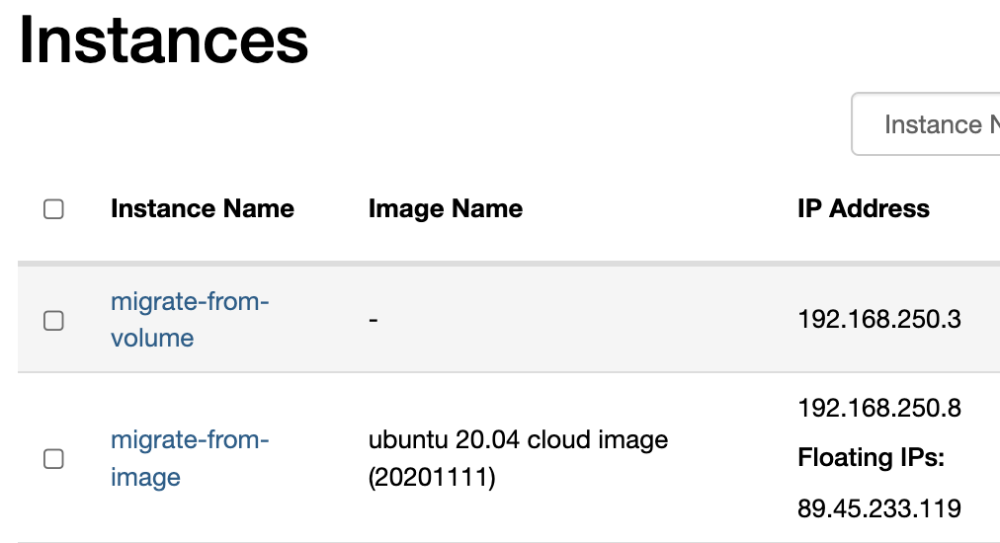

# Migrate from legacy platform

Safespring has developed a method for migrating volumes from the legacy platform to our
current platform. This guide describes what the user needs to do in order to use the method. 

## Two cases
The preparations will differ depending on which kind of flavor or storage that the instance in the legacy platform is using:

1. Instance is booting from image using ephemeral boot storage or local disk.
2. Instance is booting from volume using persistent storage.

You can tell if you instance is booting from image by looking in the "Image Name" column of the instance. If you see a minus sign there, the instance is booting from volume and belong to case 2. If you see an image name there, it belongs to case 1.



If you want to migrate an external volume that is not used for booting an instance, follow the instructions for case 2.

## Case one
This case covers when the instance boots from image:

1. Shut off the instance
2. Create a snapshot of the instance in Horizon.
3. Create a volume from the snapshot.
4. Create a volume snapshot from the volume created from the instance snapshot.
5. Mark the volume snapshot with the meta-data tag "migrate_to=<project-id of project i v2 to where the volume should be migrated>". The API commands how to do this is listed below.
6. Contact Safespring and ask them to run the tooling for migrating the volume. This will eventually be an automatic process that runs at specific times but for now Safespring runs the scripts manually.
7. Once the migration is done the volume snapshot in legacy will get the meta-data tag "migrate_status='volume_synced'" set. This can only be viewed with API in legacy by running ```openstack volume snapshot show <snapshot-id>```
In the new platform the metadata can be viewed in Horizon and there you should see the metadata tags "migrate_status=volume_synced" as well as the project id from which the volume was migrated in legacy.
8. The volumes belonging to the instance will now be visible in the destination project in the new platform so you can now create the instance again from the boot volume, and potential additional volumes that the instance had in the legacy platform.
9. Try to boot up the instance from the migrated volume and check that everything works as it should. Also attach secondary volumes that you might have migrated with the same method.
10. After a couple of days of running in the new instance, don't forget to remove the old instance, including the created volume snapshot and volume in the legacy platform.

## Case two
When an instance is already booting from a volume, it is simpler and you can skip step 2 and 3 in the listing above and only shut off the instance and start from step 4, and then continue following the same instructions.

## How to set the metadata tag for migration 

Determine which project the volume snapshot should be migrated to in the destination and run the
following command:

```
openstack volume snapshot set --property 'migrate_to=<project id>' <volume snapshot>
```

## API commands to create create a volume from snapshot
To automate the creation of the volume snapshot from an instance booting from image, you can run the following commands after you have created the snapshot of the instance in Horizon:
```code
(cli): openstack image list --private
(cli): openstack volume create --image <image_id> --size <size> <vol-name>
(cli): openstack volume snapshot create --volume <volume_id> --property migrate_to=<v2_project_id>


```

## Convert an instance to boot from local disk in the new platform
If the original instance in legacy booted from local disk you might want to do the same in the new platform. 
If you follow the method above you will end up with a volume which you can boot from, but that will be from shared
storage and not local disk. In order to boot from local disk in the new platform you need to perform the following extra steps:

1. Boot up the instance from the migrated volume.
2. Create a snapshot from the instance.
3. Start a new instance, using a local disk flavor (l2-series) with enough local disk to house the snapshot.
4. You can now delete the first instance booting from the migrated volume. 
